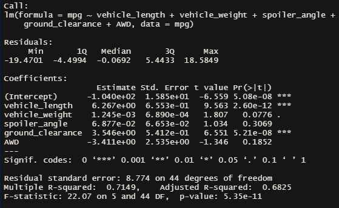
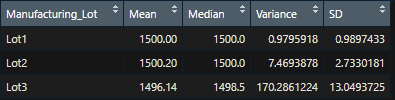
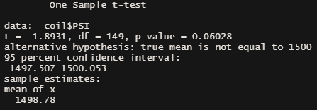
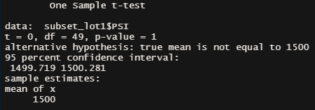
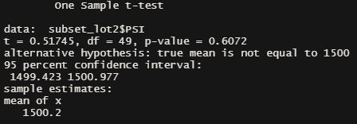
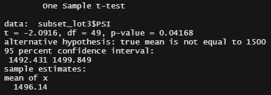

# MechaCar_Statistical_Analysis

## Overview
Two datasets were reviewed: 

The MechaCar_mpg.csv dataset contains mpg test results for 50 prototype MechaCars. The MechaCar prototypes were produced using multiple design specifications to identify ideal vehicle performance.

The Suspension_Coil.csv dataset contains the results from multiple production lots. In this dataset, the weight capacities of multiple suspension coils were tested to determine if the manufacturing process is consistent across production lots.

R and RStudio were used to perform statistical analyses on the datasets to provide insights that may help the vehicle manufacturing team.

## Linear Regression to Predict MPG

To perform a multiple linear regression analysis on the MechaCar_mpg.csv dataset, the lm() function was used. The mpg column was used as the dependent variable. The vehicle length and weight, spoiler angle, ground clearance, and AWDS columns were used as the independent variables. The R-squared value is 0.7149 and the p-value is 5.35e-11.

The variables and coefficients that provided a non-random amount of variance to the mpg values in the dataset are vehicle length (coefficient of approximately 6.3 and p-value of approximately 2.60e-12) and ground clearance (coefficient of approximately 3.55 and p-value of approximately 5.21e-12). 

The slope of the linear model is not to be considered zero since the p-value of the linear regression is approximately 5.35e-11, which is much smaller than our assumed significance level of 0.05%. Therefore, we can state that there is sufficient evidence to reject our null hypothesis, which means that the slope of our linear model is not zero.

If looking at each variable’s slope independently:
The slope of the linear model for vehicle length, ground clearance, and AQD are not to be considered zero since the coefficient of each variable does not show a slope equal to or close to 0. The slope of vehicle length is approximately 6.27; the slope of ground clearance is approximately 3.55; and the slope of AQD is approximately -3.41.

The slope of the linear model for vehicle weight and spoiler angle are considered to be zero since the coefficient of each variable shows a slope close to 0. The slope of vehicle weight is approximately 1.25e-3; the slope of the spoiler angle is approximately 6.88e-2. 

The linear model is somewhat effective in predicting the mpg of MechaCar prototypes effectively. The R-squared value shows that approximately 71.5% of the variability of mpg is explained using this linear model. 

## Summary Statistics on Suspension Coils

The Total Summary dataframe was created by using the summarize() function to determine the mean, median, variance, and standard deviation of the PSI column. The Total Summary represents the population of the data. The Lot Summary dataframe is similar to the Total Summary dataframe, except the group_by() function was used to group by each Lot number from 1 thru 3. The Lot Summary represents the subset of the population data. The mean, median, variance, and standard deviation of Lot 3 differs the most when compared to Lots 1 and 2.

The design specifications for the MechaCar suspension coils dictate that the variance of the suspension coils must not exceed 100 psi. The population as a whole (Total Summary), does meet the design specification since the variance is approximately 62.29. The Lot Summary shows that Lot 1 (0.98) and Lot 2 (7.47) meets the design specification. However, Lot 3 (170.29) does not meet the design specification. Variance is defined as the spread between numbers in a data set. The variance for Lot 3 demonstrates that there is a lot of variability between each vehicle ID. 

## T-Tests on Suspension Coils

A t-test statistical analysis was conducted for the population data for the MechaCar suspension coils data. The null hypothesis for the t-test is that there is no statistical difference between the observed sample mean and its presumed population mean. Additionally, the mu or the true value of the mean was set as 1500.

The p-value is 0.06028. Assuming a significance level of 0.05, the p-value is greater than the significance level. Therefore, we fail to reject the null hypothesis. The two means are statistically similar. 

Within the t.test() function, a subset was used to specify the manufacturing lot of Lot 1. The p-value is 1, which is the maximum range of a p-value. The mean for Lot 1 is 1500; therefore, the two means are equal to one another. 

Within the t.test() function, a subset was used to specify the manufacturing lot of Lot 2. The p-value is 0.6072. Assuming a significance level of 0.05, the p-value is greater than the significance level. Therefore, we fail to reject the null hypothesis. The two means are statistically similar. 

Within the t.test() function, a subset was used to specify the manufacturing lot of Lot 3. The p-value is 0.04168. Assuming a significance level of 0.05, the p-value is less than the significance level. Therefore, we can reject the null hypothesis. The two means are not statistically similar.

## Study Design: MechaCar vs Competition

After the Volkswagen emissions scandal that began in 2015, consumers are weary whether AutosRUs’ claim that the MechaCars’ combined fuel economy is accurate and is better than its competitors. To reassure the prospective MechaCar consumers, AutosRUs’ will conduct a statistical study.

The null hypothesis for the statistical study is: there is no statistical difference between the observed sample means and the presumed population mean. 

The alternate hypothesis for the statistical study is: there is a statistical difference between the observed sample means and the presumed population mean.

Multiple one-sample t-tests will be used to test the hypothesis. A one-sample t-test addresses the analytical question of: Is there a statistical difference between the mean of the sample distribution and the mean of the population distribution. A sample of the MechaCar prototypes will be tested to determine the combined fuel economy. Using the one-sample t-test, it will be compared against AutosRUs’ claim of the combined fuel economy. Similarly for the other t-tests, a sample of each competitor’s cars will be tested to determine the combined fuel economy and compared with the advertised combined fuel economy for each car. Additionally, the sample means can be used to determine whether MechaCars’ combined fuel economy is better than its competitors.

In order to conduct the statistical test, a sample of MechaCar‘s combined fuel economy data is needed. Additionally, AutosRUs’ will need to determine which vehicles will be a direct competition of the MechaCar. When this is determined, a sample of each competitor’s vehicle’s combined fuel economy will be needed. All of this data will be used in the one-sample t-test. 

In order for the one-sample t-test to be conducted, AutosRUs’ must confirm the following:
- The data is normally distributed. A Shapiro-Wilk test can be conducted.
- The sample sizes are randomly selected from the population data and is reasonably large.
- The variance of the data should be similar. 

